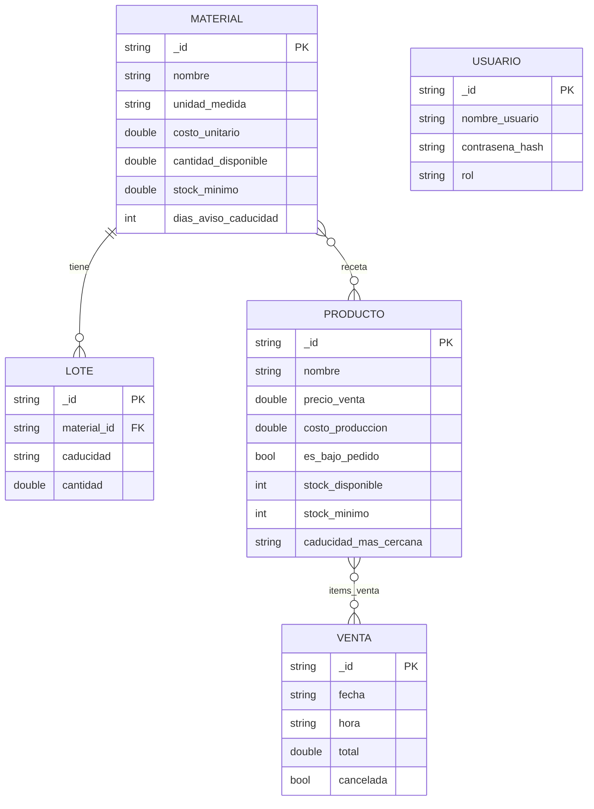

# StackPile: Gestor de Inventarios

> [Video de demostración](https://youtu.be/5UdSEzlsOog).

Este proyecto es una Aplicación Android para que los negocios o empresas pequeñas puedan monitorear su rendimiento, egresos, ingresos,
materiales, inventario de producción, ventas, ganancias y pérdidas; todo sin internet, de forma local y de forma gratuita.

---
Proyecto final de la materia **Desarrollo de Aplicaciones Móviles**.

> *Equipo 1 - Sr Lucxs Studio*
 - DHH 2989955 [@CikiUmi](https://github.com/CikiUmi)
 - MHQ 3001084 [@WahWau](https://github.com/WahWau)
 - JMDR 7090780 [@SrLucas-tecx](https://github.com/SrLucas-tecx)

Los negocios y emprendimientos que inician usualmente no cuentan con un sistema de inventario o materiales: llevan las cuentas a mano, 
con un Excel o programas no especializados que limitan el crecimiento. Stackpile es una herramienta personalizable que cubre todo lo 
necesario para administrar un negocio (materia prima, reccetas, producción, un sistema de ventas y métricas). Toda la información se 
guarda en el celular y no queda atada a él, se puede exportar en formato `.csv`; haciendo sencilla la migración entre herramientas.

---

## Funciones principales

- **Inventario de materiales.** Cada material tiene unidad de medida, costo unitario y stock. Un material puede tener varios lotes, cada uno con su propia fecha de caducidad y su cantidad configurables. Los lotes se eliminan deslizando.

- **Catálogo de productos con receta.** Un producto declara de qué materiales está hecho y cuánto usa de cada uno. La app calcula su costo de producción real, y el usuario solo pone el precio de venta. Un producto puede tener stock propio o ser bajo pedido.

- **Producción.** Al dar de alta existencias de un producto, la app pregunta si descuenta los materiales del inventario ahora o no, y el producto hereda la caducidad más próxima de los materiales que lo forman.

- **Ventas.** El registro de una venta descuenta del stock del producto si lo hay, y si no, descuenta los materiales de su receta. Una venta no se edita ni se borra: solo se puede cancelar, al haccerlo el stock se devuelve. El precio y el costo quedan congelados en el renglón de la venta, así que un cambio de precios no reescribe el histórico.

- **Avisos y notificaciones.** La app anuncia stock bajo y caducidades (próximas y ya vencidas) con franjas en las pantallas donde importan y una bandeja de avisos propia. El usuario define cuánto es "stock bajo" por material y con cuántos días de antelación quiere el aviso.

- **Rendimiento del negocio.** Ingresos, ganancias, pérdidas y productos más vendidos, en tarjetas, barras y dona, filtrables por día, semana o mes. El eje de la gráfica cambia con el filtro: tramos de horas en "día", días en "semana", semanas en "mes".

- **Equipo y permisos.** Tres roles personalizables (administrador, encargado y empleado) con una sola regla de permisos consultada desde toda la interfaz: lo que un rol no puede hacer, no se le muestra.

- **Exportación.** Seis archivos `.csv` que se entregan por la hoja de compartir de Android (Drive, correo, Archivos). Ver [Exportación](#exportación).

- **Bitácora.** Todo cambio en el inventario, venta o movimiento manual, queda registrado con fecha y descripción.

---
## Modelo de datos

Las dos relaciones muchos-a-muchos se resuelven con tablas puente, que es lo que son `receta` e `items_venta`:

- **`receta`** une productos con materiales y guarda `cantidad_usada`. Su llave primaria es compuesta —`(producto_id, material_id)`— para que la base impida que un producto lleve dos veces el mismo material.
- **`items_venta`** une ventas con productos y guarda, además de la cantidad, el precio y el costo del día de la venta. Son los que hacen que el histórico no se mueva cuando los precios de hoy cambian.

> [!NOTE]
> Las fechas se guardan como texto `"aaaa-mm-dd"`. Con ese formato el orden alfabético es el orden cronológico, `ORDER BY caducidad ASC` devuelve la más próxima primero sin necesidad de un conversor.

La base está en la versión 6 con migración destructiva: al cambiar de versión se borra y se empieza de cero. Fue una decisión que se tomó para el desarrollo del proyecto.

---

## Exportación

Seis archivos `.csv`, uno por tabla, que se abren directo en Excel o Sheets:

| Archivo | Contenido |
|---|---|
| `productos.csv` | id, nombre, precio de venta, bajo pedido, stock, stock mínimo |
| `inventario.csv` | id, nombre, unidad, costo unitario, cantidad, stock mínimo |
| `ventas.csv` | id, fecha, hora, total, cancelada |
| `recetas.csv` | producto ↔ material, con la cantidad usada |
| `lotes.csv` | lote ↔ material, con caducidad y cantidad |
| `venta_items.csv` | venta ↔ producto, con cantidad, precio y costo congelados |

Los tres últimos son las relaciones (tablas puente).

Los archivos se escriben en el almacenamiento privado de la app y se entregan por la hoja de compartir de Android. 
---

## Accesibilidad

La interfaz está construida pensando en TalkBack, no adaptada después:

- Cada control tiene su etiqueta; los iconos decorativos llevan `contentDescription = null` a propósito, para no leer basura.
- Las tarjetas y filas usan `mergeDescendants` para anunciarse como un solo elemento en vez de deletrear cada texto suelto.
- Los interruptores y las opciones usan el rol semántico que les toca (`Switch`, `RadioButton`), así que el lector anuncia su estado.
- Los campos de texto llevan su etiqueta dentro de la semántica y marcan el error con `error()`.
- Los títulos de sección están marcados como encabezados, para poder saltar entre ellos.
- Nada se comunica sólo con iconos, hay descripciones en todo.

---

## Limitaciones (fuera del alcance de este proyecto)

- **Las contraseñas se guardan con SHA-256 sin sal.** Es suficiente para que no queden en texto plano en una base local, pero no es lo que se usaría en producción.
- **El `.csv` no va cifrado.** Cifrarlo de verdad requiere empaquetarlo en un `.zip` con clave y una librería externa; se prefirió no exportar un archivo que dijera ser seguro sin serlo.
- **El lienzo de las gráficas es invisible para un lector de pantalla.** Los mismos datos están en las tarjetas y en la leyenda de texto que las acompañan.
- **No hay sincronización entre dispositivos ni respaldo en la nube.** Está fuera del alcance del proyecto por diseño; la exportación a `.csv` es la salida prevista para los datos.
- **Al descontar materiales no se distingue qué lote caduca primero.** El sistema asume que el usuario consume primero los que caducan antes.

---

## Tecnologías :D

| | |
|---|---|
| Lenguaje | Kotlin 2.2.10 |
| Interfaz | Jetpack Compose · Material 3 |
| Base de datos | Room 2.8.4 (SQLite local) |
| Inyección de dependencias | Hilt 2.60.1 + KSP |
| Navegación | Navigation Compose 2.9.8 |
| Tipografía | Nunito y Lora, vía Google Fonts |
